# Gestion des Vacataires à l'École Supérieure de Technologie de Salé

### Contributeurs
- EL HADDAJ Aya : elhaddaj.aya@gmail.com
- AKJIJ Salma : akjij.salma@gmail.com
- AMRAOUI Hind : hindamraoui543@gmail.com

## Description

Ce projet est une application web développée pour gérer les vacataires de l'École Supérieure de Technologie de Salé. Elle permet aux vacataires de soumettre leurs informations personnelles et documents, et aux administrateurs de gérer les dossiers, valider ou refuser les soumissions, effectuer des virements, et définir des délais de dépôt. L'application inclut également des fonctionnalités d'authentification, de gestion des administrateurs (ajout, suppression, suspension), et d'envoi d'e-mails pour les notifications.

### Fonctionnalités principales :
- **Espace Vacataire** : Soumission des informations personnelles (Phase 1), téléversement des documents (Phase 2), suivi de l'état du dossier et du virement (Phase 3).
- **Espace Admin** :
  - Gestion des vacataires (liste, étude de dossier, validation/refus, virement).
  - Gestion des administrateurs (ajout, suppression, suspension/activation).
  - Définition du délai de dépôt des documents.
- **Notifications par e-mail** : Envoi d'e-mails pour la validation, le refus ou l'exécution des virements.
- **Authentification** : Système de connexion sécurisé pour les vacataires et les administrateurs (avec hachage des mots de passe).
- **Interface utilisateur** : Interface responsive avec barre de recherche, pagination, et modales pour les confirmations.

## Prérequis

Avant de commencer, assurez-vous d'avoir les éléments suivants installés :

- **Node.js** (version 14.x ou supérieure) et **npm** (pour le backend et le frontend).
- **MySQL** (pour la base de données).
- Un serveur de messagerie configuré (par exemple, un compte Gmail pour l'envoi d'e-mails via Nodemailer).
- Un navigateur web moderne (Chrome, Firefox, etc.).

## Installation

### 1. Cloner le dépôt
Clonez le dépôt Git sur votre machine locale :
```bash
git clone <URL_DU_DEPOT>
cd <NOM_DU_PROJET>
```

### 2. Configurer le Backend
1. Naviguez vers le dossier du backend :
   ```bash
   cd backend
   ```
2. Installez les dépendances :
   ```bash
   npm install
   ```
3. Créez un fichier `.env` dans le dossier `backend` et configurez les variables d'environnement suivantes :
   ```env
   PORT=5000
   EMAIL_SERVICE=gmail
   EMAIL_HOST=smtp.gmail.com
   EMAIL_PORT=587
   EMAIL_SECURE=false
   EMAIL_USER=<votre_email@gmail.com>
   EMAIL_PASS=<votre_mot_de_passe_d_application>
   ```
   > **Note** : Pour `EMAIL_PASS`, si vous utilisez Gmail, vous devez générer un mot de passe d'application via les paramètres de sécurité de votre compte Google.

4. Configurez la base de données MySQL :
   - Créez une base de données nommée `vacataires_db`.
   - Importez le schéma de la base de données (si fourni) ou créez les tables nécessaires (voir le fichier `app.js` pour les requêtes SQL utilisées).
   - Mettez à jour les informations de connexion dans `backend/config/db.js` avec vos identifiants MySQL.

5. Lancez le serveur backend :
   ```bash
   npm start
   ```
   Le serveur démarrera sur `http://localhost:5000`.

### 3. Configurer le Frontend
1. Naviguez vers le dossier du frontend :
   ```bash
   cd frontend
   ```
2. Installez les dépendances :
   ```bash
   npm install
   ```
3. Lancez le serveur de développement :
   ```bash
   npm start
   ```
   L'application frontend démarrera sur `http://localhost:3000`.

### 4. Tester l'application
- Accédez à `http://localhost:3000` dans votre navigateur.
- Connectez-vous avec un compte vacataire ou administrateur (vous devrez peut-être créer un compte via la base de données ou l'interface admin).

## Utilisation

### Pour les Vacataires :
1. **Connexion** : Utilisez votre identifiant et mot de passe pour vous connecter.
2. **Suivi de Dossier** :
   - **Phase 1** : Remplissez vos informations personnelles.
   - **Phase 2** : Téléversez les documents requis (photo, CIN, CV, diplômes, etc.).
   - **Phase 3** : Suivez l'état de votre dossier (En cours, Validé, Refusé) et de votre virement.
3. **Notifications** : Vous recevrez des e-mails pour les mises à jour importantes (validation, refus, virement effectué).

### Pour les Administrateurs :
1. **Connexion** : Utilisez vos identifiants (superadmin, admin, comptable).
2. **Gestion des Vacataires** :
   - Consultez la liste des vacataires, étudiez leurs dossiers, validez ou refusez-les.
   - Effectuez des virements une fois les dossiers validés.
3. **Gestion des Administrateurs** (Superadmin uniquement) :
   - Ajoutez, supprimez ou suspendez des administrateurs.
4. **Délai de Dépôt** (Superadmin uniquement) :
   - Définissez une date limite pour le dépôt des documents.

## Structure du Projet

- **Backend** (`app.js`) :
  - Gère les API REST pour la gestion des vacataires, administrateurs, et délais.
  - Utilise Express.js, MySQL, Nodemailer, et Multer pour le téléversement de fichiers.
- **Frontend** :
  - Composants React pour l'interface utilisateur (VacataireList, EtudeDossier, SuiviDossier, etc.).
  - Styles CSS définis dans `styles/` et fichiers spécifiques (phase1.css, phase2.css, etc.).
- **Base de Données** :
  - Tables principales : `vacataire`, `admin`, `settings`, `enseigner`, `filiere`, `departement`.

## Screenshots

### Modèle Conceptuel de Données (MCD)
Le Modèle Conceptuel de Données (MCD) illustre les relations entre les entités principales de l'application.

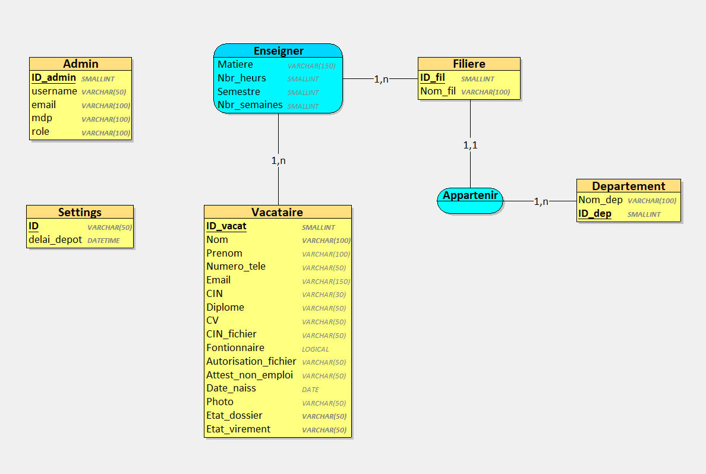

### Structure de la Base de Données
La structure de la base de données montre les tables et leurs colonnes, ainsi que les relations entre elles.

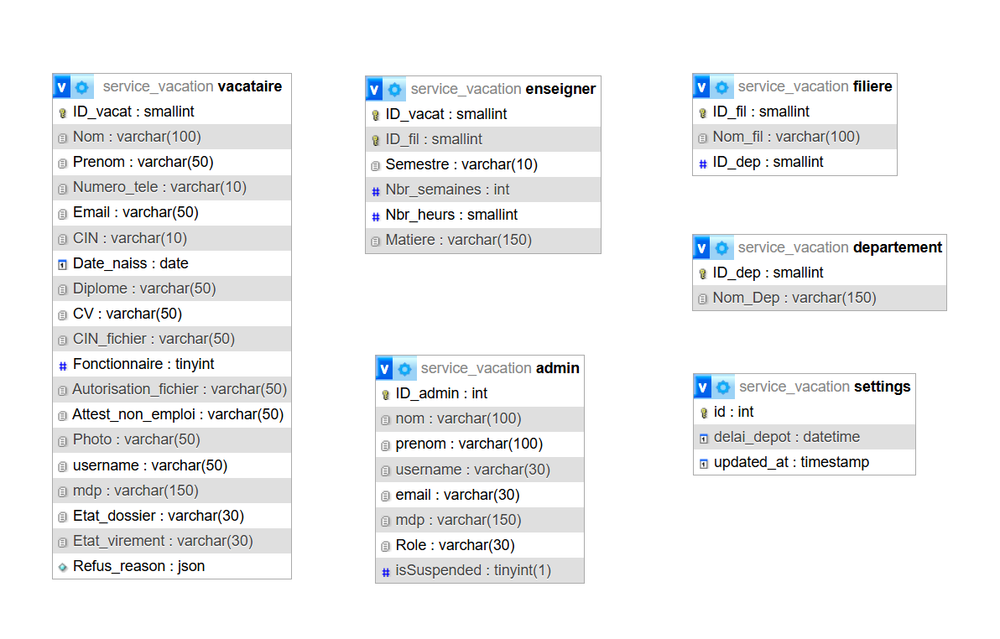

### Interfaces de l'Application
Voici quelques captures d'écran des principales interfaces de l'application :

#### Page de Connexion
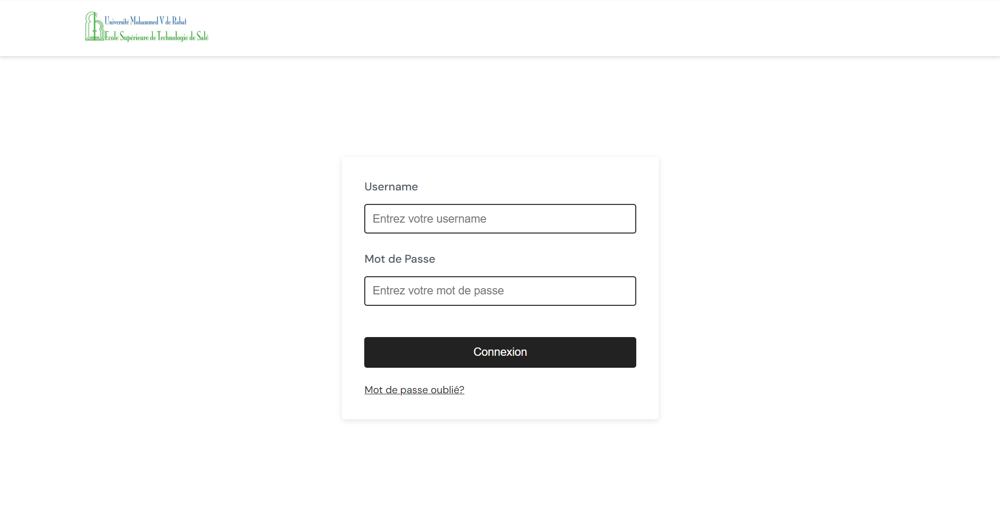

#### Suivi de Dossier (Vacataire) - Phase 1
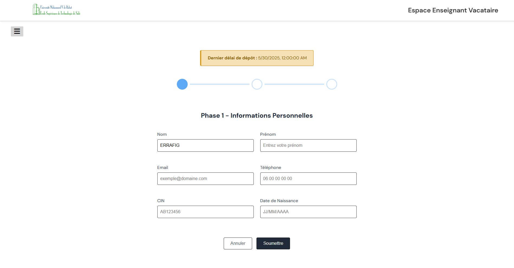

#### Suivi de Dossier (Vacataire) - Phase 2
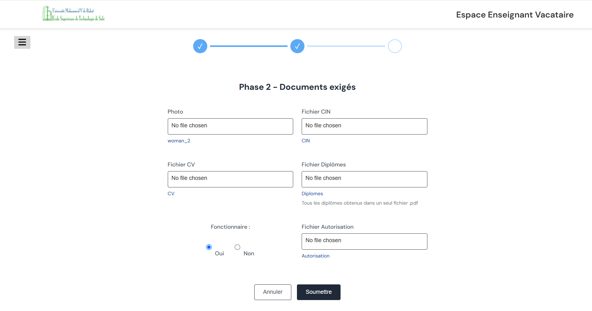

#### Suivi de Dossier (Vacataire) - Phase 3 (En cours)
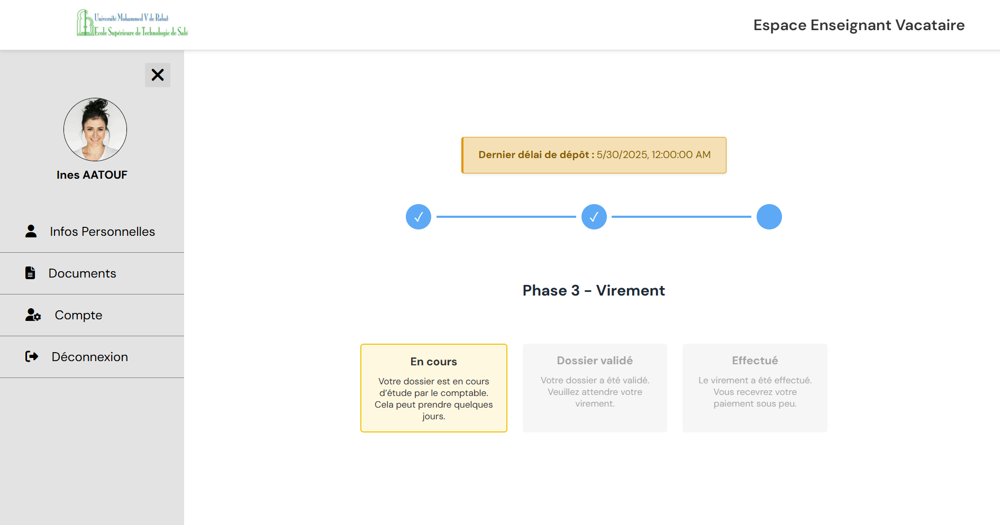

#### Suivi de Dossier (Vacataire) - Phase 3 (Validé)
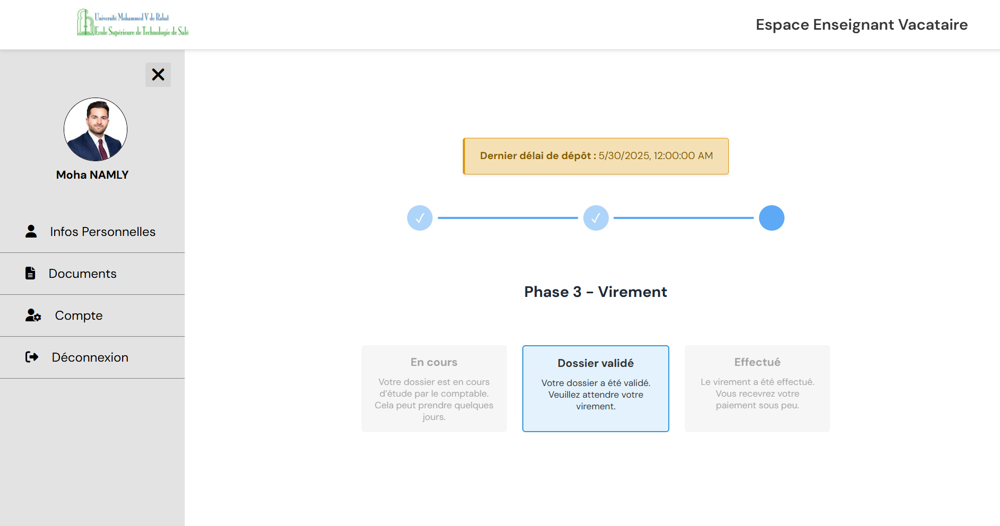

#### Suivi de Dossier (Vacataire) - Phase 3 (Effetué)
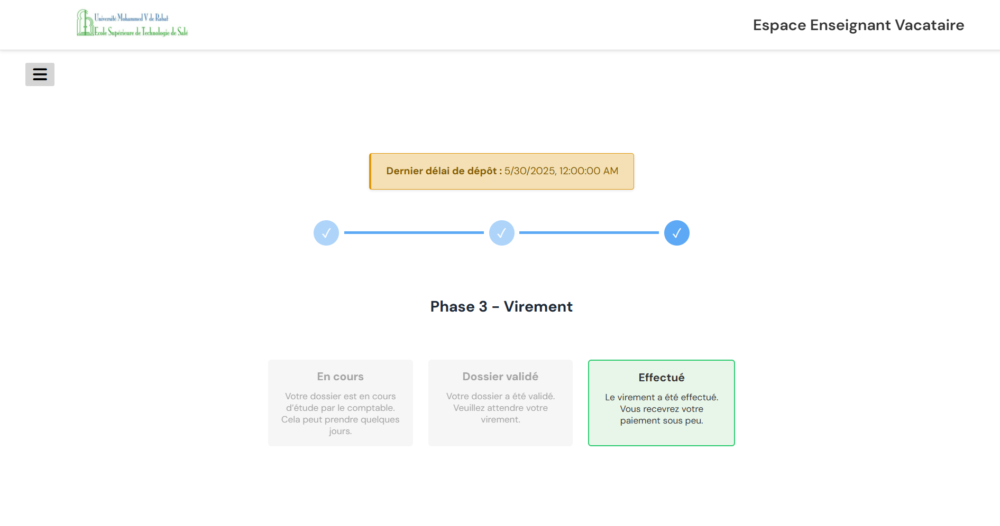

#### Liste des Vacataires (Admin)
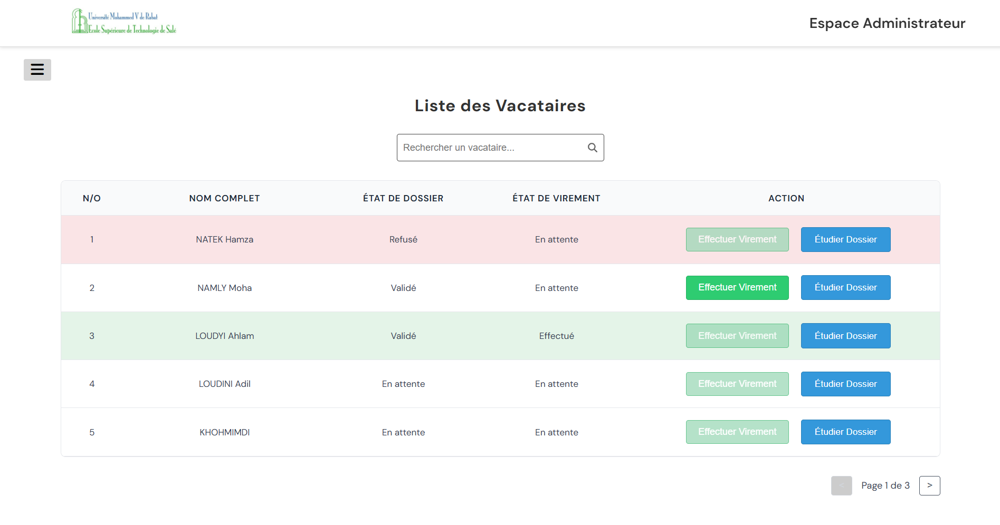

#### Étude de Dossier (Admin)
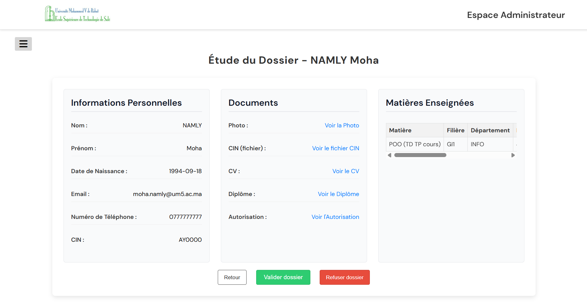

#### Gestion des Administrateurs (Superadmin)
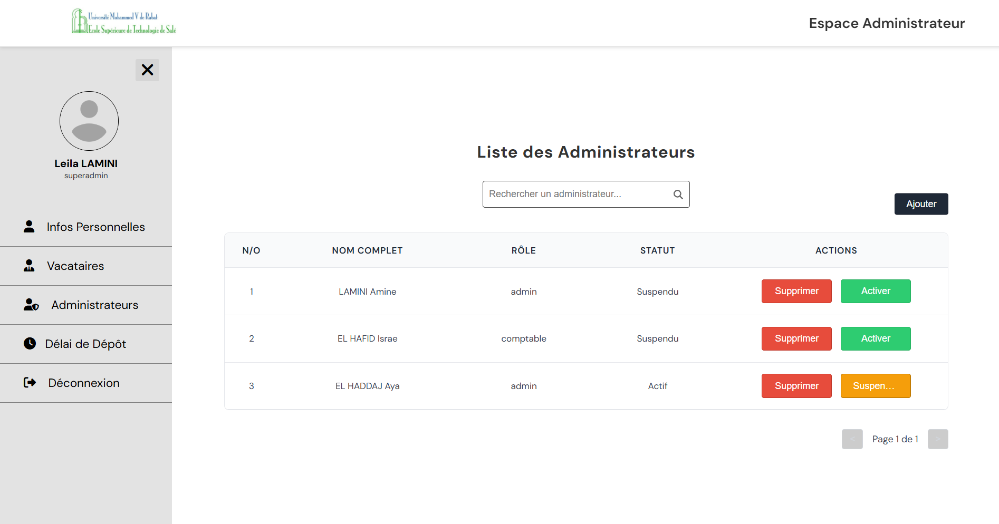

#### Définition du Délai de Dépôt (Superadmin)
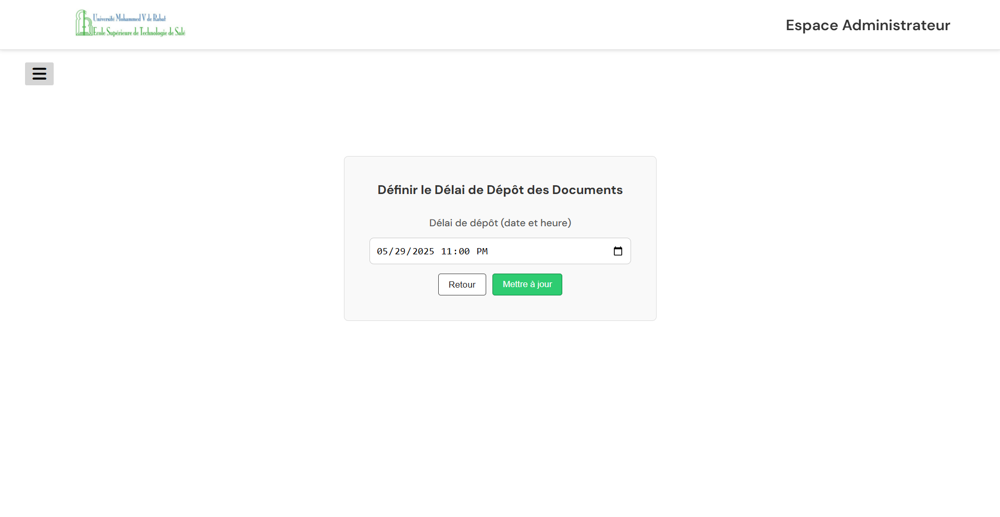

## Dépendances Principales

### Backend :
- `express` : Framework pour les API.
- `mysql2` : Connexion à la base de données MySQL.
- `nodemailer` : Envoi d'e-mails.
- `multer` : Gestion des téléversements de fichiers.
- `bcrypt` : Hachage des mots de passe.
- `cors` : Gestion des requêtes cross-origin.

### Frontend :
- `react` : Bibliothèque pour l'interface utilisateur.
- `axios` : Requêtes HTTP.
- `react-router-dom` : Navigation entre les pages.
- `@fortawesome/react-fontawesome` : Icônes.

## Instructions pour Configurer l'Envoi d'Emails

Pour activer l'envoi d'emails, configurez les paramètres suivants dans un fichier `.env` à la racine du projet :

1. Copiez `.env.example` et renommez-le en `.env`.
2. Remplissez les champs avec les informations fournies par le département IT de l'EST Salé :
   - `EMAIL_USER` : Adresse email officielle (ex: `noreply@estsale.ac.ma`).
   - `EMAIL_PASS` : Mot de passe ou App Password (à demander au département IT).
   - `EMAIL_SERVICE` : Service email (ex: `gmail`, ou nom du serveur interne).
   - `EMAIL_HOST` : Hôte SMTP (ex: `smtp.gmail.com` pour Gmail).
   - `EMAIL_PORT` : Port SMTP (587 pour TLS, 465 pour SSL).
   - `EMAIL_SECURE` : `true` pour port 465, `false` pour 587.
3. Placez le logo de l'EST Salé (`est_logo.png`) dans le dossier `public/`.
4. Lancez le serveur avec `node app.js` et testez l'envoi d'emails.
